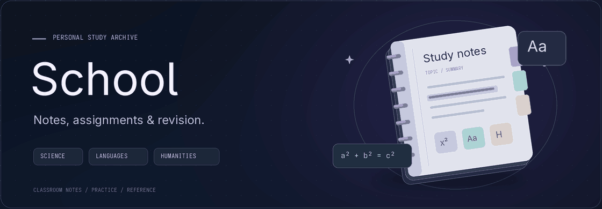

  <picture>
    <source media="(prefers-reduced-motion: reduce)" srcset=".github/assets/school-banner.png">
    
  </picture>

  Markdown &nbsp;·&nbsp; Obsidian &nbsp;·&nbsp; Polish school curriculum

---

School notes, assignments, and revision materials, organized by year, subject, and topic.

The collection follows the Polish school curriculum and includes material in Polish, Russian, English, and German. It contains both classroom notes and more detailed explanations prepared for revision.

## Study materials

| Material | Description |
| --- | --- |
| **Notes** | Topic summaries, definitions, formulas, and reference tables. |
| **Practice** | Exercises, worked solutions, and test preparation. |
| **Language resources** | Vocabulary, grammar notes, essays, and writing assignments. |
| **Literature and history** | Text analysis, character studies, and historical overviews. |
| **AI prompts** | Instructions for transcribing printed and handwritten text, formatting notes, generating exercises, and checking answers. |

## Subjects

| Area | Subjects |
| --- | --- |
| **Science** | Mathematics, physics, chemistry, biology |
| **Humanities** | History, geography, Polish language and literature, civic education |
| **Languages** | English, German |
| **Business** | Business and management, financial literacy |

## Format

Most notes are written in Markdown and maintained in Obsidian. They can be read directly on GitHub, though internal note links and some formatting work best in Obsidian.

> These are working notes, not a complete textbook. Coverage varies, and some content is AI-assisted. Check answers and explanations against course materials when needed.
